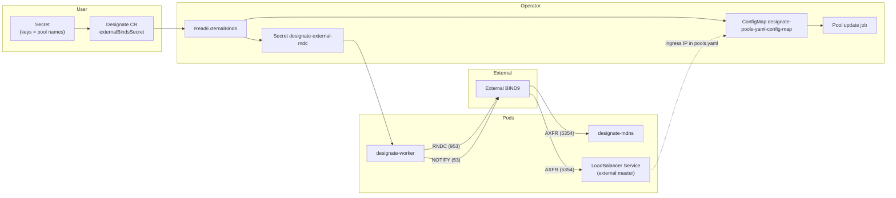
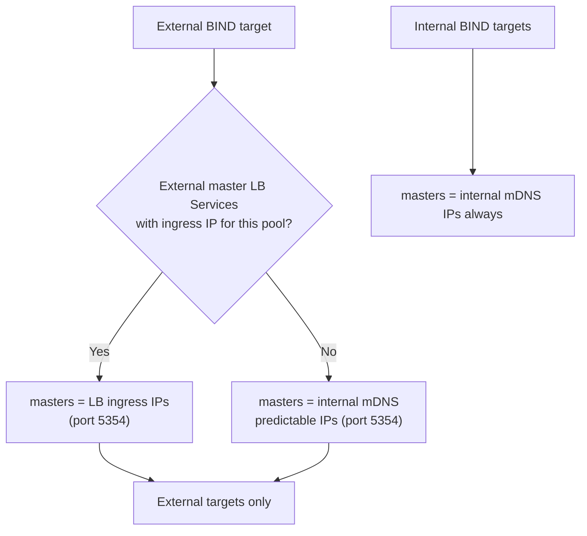

# External BIND9 Configuration

This document describes how to configure the designate-operator to use
pre-existing BIND9 servers that are **not** managed by the operator. This is
useful when you already have authoritative DNS infrastructure and want
Designate to push zone data to those servers via RNDC.

## Overview

The operator-managed BIND9 backends (`DesignateBackendbind9` resources) run
inside the Kubernetes cluster as StatefulSets. External BIND9 support lets you
add one or more BIND9 servers that live outside the cluster (or are managed by
a different system) as additional pool targets. Designate's worker service
connects to them over RNDC to update zones and sends DNS NOTIFY so the external
servers can pull zone data via AXFR from the mDNS service.

External BIND9 targets are **appended** to the default pool alongside any
operator-managed backends. You can run a mix of internal and external targets
in the same pool, or external-only targets when `bind9ReplicaCount` is zero.

> **Multipool limitation:** External binds are fully supported in single-pool
> (default pool) deployments only. If `designate-multipool-config` is present,
> the operator still parses the secret and generates RNDC keys, but external
> targets are **not** added to `pools.yaml` today.

## Architecture



### Traffic paths

| Path | Port | Direction | Required for |
|------|------|-----------|--------------|
| Worker → external BIND | RNDC (953 default) | Outbound from worker pods | Zone updates via RNDC |
| Worker → external BIND | DNS (53 default) | Outbound from worker pods | NOTIFY to trigger AXFR |
| External BIND → mDNS / external master | mDNS (5354) | Inbound to master IPs | AXFR zone transfer |

The worker is the source of both RNDC calls and DNS NOTIFY messages to external
BIND9 targets. mDNS pods must be reachable from external BIND9 servers on port
5354 so that BIND9 can perform the subsequent AXFR zone transfer.

## Prerequisites

### Designate configuration

External targets appear in `pools.yaml` only when **all** of the following are
true:

1. `spec.externalBindsSecret` references a valid secret in the same namespace
   as the Designate CR.
2. NS records are configured (`spec.nsRecords` and/or the
   `designate-ns-records-params` ConfigMap).
3. `DesignateCentral` is ready (`designateCentralReadyCount > 0`).

Without NS records, the operator does not generate or update the pools
ConfigMap, so external binds have no effect on the running pool.

### External BIND9 server configuration

For each external server:

- RNDC must be enabled and reachable from designate-worker pods on the RNDC
  port (default 953).
- The server must accept NOTIFY from the workers IPs and allow AXFR
  from those masters on the specified port.
- `rndckeyname` and `rndcalgorithm` in the secret must match the key clause in
  the server's `named.conf` / `rndc.conf`.
- The RNDC shared secret must be base64-encoded in the secret (same encoding
  BIND uses in its config files).

### Networking on OpenShift / Kubernetes

Pod traffic is often not routable to external networks by default. Additional cluster
configuration may be necessary to configure the necessary connectivity between the
external DNS server, designate-worker pods and the kubernetes services for the
mDNS pods.

1. **Create a NetworkAttachmentDefinition (NAD)** in the **same namespace** as
   the Designate pods. The NAD must provide connectivity to the network where
   the external BIND9 servers reside.

2. **Attach the NAD to designate-worker** via the Designate
   CR to worker for RNDC and NOTIFY:

   ```yaml
   apiVersion: designate.openstack.org/v1beta1
   kind: Designate
   metadata:
     name: designate
     namespace: openstack
   spec:
     designateWorker:
       networkAttachments:
         - external-dns-net   # NAD name
         - designate
     # ...
   ```

3. **Verify routing** on the additional interface. Depending on topology you
   may need static routes or a gateway configured in the NAD.


## Step 1: Create the External Binds Secret

Create a Kubernetes Secret in the **same namespace** as the Designate CR. Each
secret data **key** is a pool name; each **value** is a YAML array of external
BIND9 entries.

In single-pool mode the key must be `default`:

```yaml
apiVersion: v1
kind: Secret
metadata:
  name: designate-external-binds
  namespace: openstack
type: Opaque
stringData:
  default: |
    - name: site-a-ns1
      address: 192.168.100.10
      rndcsecret: c2VjcmV0YmFzZTY0ZW5jb2RlZA==
    - name: site-a-ns2
      address: 192.168.100.11
      rndcsecret: YW5vdGhlcnNlY3JldA==
      rndckeyname: my-rndc-key
      rndcalgorithm: hmac-sha512
      rndchost: 192.168.100.12
      rndcport: 5953
      port: 5353
```

### Field reference

| Field | Required | Default | Description |
|-------|----------|---------|-------------|
| `name` | No | `external-bind9-{address}` | Human-readable name used in pool target descriptions. |
| `address` | **Yes** | — | IP address of the BIND9 server (used for DNS and as the nameserver entry). |
| `port` | No | `53` | DNS port on the BIND9 server. |
| `rndcsecret` | **Yes** | — | Base64-encoded RNDC shared secret. |
| `rndckeyname` | No | `rndc-key` | Name of the RNDC key clause. Must match the key name in the BIND9 server's `rndc.conf` / `named.conf`. |
| `rndcalgorithm` | No | `hmac-sha256` | Algorithm for RNDC. Common values: `hmac-sha256`, `hmac-sha512`. |
| `rndchost` | No | value of `address` | Host for RNDC connections (use when RNDC listens on a different address than DNS). |
| `rndcport` | No | `953` | Port for RNDC connections. |

The secret may contain keys for multiple pools (for example `default` and
`my-other-pool`). Only the `default` key is supported at the time of writing.

## Step 2: Reference the Secret in the Designate CR

Add `externalBindsSecret` to your Designate custom resource. The value is the
secret **name** only.

```yaml
apiVersion: designate.openstack.org/v1beta1
kind: Designate
metadata:
  name: designate
  namespace: openstack
spec:
  externalBindsSecret: designate-external-binds
  nsRecords:
    - hostname: ns1.example.com.
      priority: 1
  # ... rest of your spec
```

## What Happens

When `externalBindsSecret` is set, the operator:

1. **Reads and validates** the secret. Each entry must have `address` and
   `rndcsecret`. Validation errors set `InputReady=False` on the Designate CR.
   A missing secret sets `InputReady=False` and requeues after 10 seconds.

2. **Generates RNDC key files** in a derived secret named `designate-external-rndc`
   (fixed name, owned by the Designate CR). Each external entry becomes one
   secret key `{poolName}-rndc-{index}` (for example `default-rndc-0`) with
   content like:
   ```
   key "rndc-key" {
       algorithm hmac-sha256;
       secret "c2VjcmV0YmFzZTY0ZW5jb2RlZA==";
   };
   ```

3. **Mounts RNDC keys into workers.** The operator merges `designate-bind-secret`
   (internal BIND keys) and `designate-external-rndc` via a projected volume at
   `/etc/designate/rndc-keys` in designate-worker pods. External keys are
   mounted at `/etc/designate/rndc-keys/{poolName}-rndc-{index}`.

4. **Adds external targets to pools.yaml.** Each entry becomes a bind9 target
   and nameserver appended after internal targets. External targets use per-entry
   RNDC credentials. External nameserver addresses are also appended to
   the pool's `nameservers` list.

5. **Tracks changes.** A hash of the referenced secret content is stored in
   `status.hash["designate-external-binds"]`. When the secret changes, the
   operator regenerates `designate-external-rndc` and `pools.yaml`, rolls out
   worker pods (deployment hash env change), and may launch a **pool update job**
   when the pools hash changes.

The operator watches both the external binds secret and labeled external-master
LoadBalancer Services, so changes to either trigger reconciliation automatically.

## Master IP selection

Internal and external targets use different master addresses in `pools.yaml`:



When no external master LoadBalancer is configured, external BIND servers must be
able to reach internal mDNS predictable IPs on port 5354 (often requiring the
same Multus attachments described above).

## Removing External BIND9

To remove external BIND9 backends:

1. Remove `externalBindsSecret` from the Designate CR (or set it to an empty
   string).
2. The operator clears `designate-external-rndc` data, clears
   `status.hash["designate-external-binds"]`, and regenerates `pools.yaml`
   without external targets.
3. Delete the user-managed external binds secret when no longer needed.

## External Master Services

By default, external BIND9 targets receive NOTIFY from worker pod addresses and
perform AXFR on internal mDNS pod addresses. When pod-to-external routing is
difficult, expose mDNS on a routable LoadBalancer IP. The operator reads the
LoadBalancer **ingress IP** and writes it into `pools.yaml` as the master for
**external targets only**, so that external BIND9 servers can reach mDNS for
AXFR zone transfers.

Creating the Service makes the IP available to Designate configuration; you
must still configure `spec.selector`, firewall rules, and external BIND
`allow-transfer` / `also-notify` for real zone-transfer traffic.

### Service metadata vs pod selector

The external master Service uses **two different label sets**:

```
External Master LoadBalancer Service
├── metadata.labels          ← operator discovery (fixed values)
│     designate.openstack.org/external_master: "true"
│     service: "designate-mdns"
│
└── spec.selector            ← Kubernetes endpoint selection (match mDNS pods)
      service: "designate-mdns"
```

Always include a selector such as `service: designate-mdns` to make sure the
Service matches to a designate-mdns pod. You can create multiple services with
different selector criteria such as a pod-name selector, e.g.
`statefulset.kubernetes.io/pod-name: designate-mdns-0` and create a service for
each mdns replica.

### Creating an External Master Service

```yaml
apiVersion: v1
kind: Service
metadata:
  name: designate-mdns-external
  namespace: openstack
  labels:
    designate.openstack.org/external_master: "true"
    service: designate-mdns
  annotations:
    # Optional: restrict to a specific pool (omit to apply to all pools)
    designate.openstack.org/external_pool: "default"
spec:
  type: LoadBalancer
  ports:
    - name: mdns
      port: 5354
      targetPort: 5354
      protocol: TCP
  selector:
    service: designate-mdns        # use <designate-cr-name>-mdns if CR is not named "designate"
```

### How master discovery works

The operator lists Services in the Designate namespace matching **both**
metadata labels:

- `designate.openstack.org/external_master: "true"`
- `service: designate-mdns`

It then filters by:

- **Service type:** only `LoadBalancer` services are considered.
- **Pool annotation:** if `designate.openstack.org/external_pool` is present,
  the service applies only to the named pool (must match the secret data key,
  for example `default`). If absent, the service applies to all pools.
- **Ingress IP:** the service must have `status.loadBalancer.ingress[0].ip`
  assigned. Services without an IP will force a reconcile until the service
  receives an IP. Hostname-only ingress entries are not supported as the IPs are
  required for designate pool configuration. Each matching service contributes
  at most one IP; multiple matching services produce multiple master entries
  (sorted).

When external master IPs exist for a pool, they replace internal mDNS addresses
as masters for that pool's **external** targets only. Internal targets always
use internal mDNS predictable IPs.

## Example: Minimal Setup

This example adds one external BIND9 server to the default pool.

**1. Create the secret:**

```yaml
apiVersion: v1
kind: Secret
metadata:
  name: my-external-bind9
  namespace: openstack
type: Opaque
stringData:
  default: |
    - name: campus-ns1
      address: 198.51.100.53
      rndcsecret: bXlybmRjc2VjcmV0  # base64-encoded RNDC secret
```

**2. Reference it in the Designate CR (NS records required):**

```yaml
apiVersion: designate.openstack.org/v1beta1
kind: Designate
metadata:
  name: designate
  namespace: openstack
spec:
  externalBindsSecret: my-external-bind9
  nsRecords:
    - hostname: ns1.example.com.
      priority: 1
  # ... other spec fields
```

**3. (Optional) Expose mDNS for external access:**

```yaml
apiVersion: v1
kind: Service
metadata:
  name: designate-mdns-external
  namespace: openstack
  labels:
    designate.openstack.org/external_master: "true"
    service: designate-mdns
spec:
  type: LoadBalancer
  ports:
    - name: mdns
      port: 5354
      targetPort: 5354
  selector:
    service: designate-mdns
    component: designate-mdns
```

## Troubleshooting

**Designate reports `InputReady=False`:**

- Confirm the secret named in `externalBindsSecret` exists in the **same
  namespace** as the Designate CR.
- Verify every entry has both `address` and `rndcsecret`.
- Ensure the YAML is well-formed (a list of maps under each pool key).
- In single-pool mode, use the `default` key in the secret data.

**External targets missing from pools.yaml:**

- Confirm NS records are configured and DesignateCentral is ready.
- If using multipool mode (`designate-multipool-config` present), external binds
  are not yet merged into generated pools.

**External zones are not updating:**

- Confirm the external BIND server is reachable from worker pods on the RNDC
  port (default 953).
- Verify `rndckeyname` and `rndcalgorithm` match the BIND9 RNDC configuration.
- Check that BIND allows zone transfers from the configured master IPs (internal
  mDNS predictable IPs or external master LoadBalancer ingress IP).
- Confirm worker pods can send NOTIFY to the external server on port 53 and
  that the external server can AXFR from mDNS on port 5354.

**External master service is ignored:**

- Service type must be `LoadBalancer` with `status.loadBalancer.ingress[0].ip`
  assigned (not hostname-only).
- Metadata labels must include `designate.openstack.org/external_master: "true"`
  and `service: designate-mdns`.
- If `designate.openstack.org/external_pool` is set, it must currently be
  `default`.
- For actual zone transfers, verify `spec.selector` matches mDNS pod labels and
  that firewalls allow AXFR on port 5354 to the LoadBalancer IP.

**Worker rolled out but pool still stale:**

- A pools hash change triggers a pool update job in addition to the worker
  rollout. Check pool update job logs if external targets appear in the
  `designate-pools-yaml-config-map` ConfigMap but Designate has not applied them.
